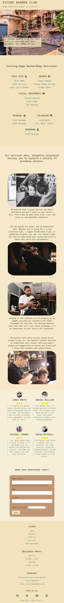
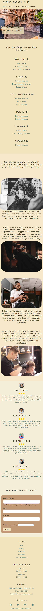
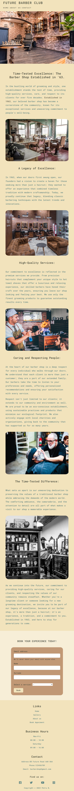
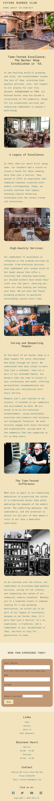

# Future Barber Club

Welcome to the Future Barber-Shop project! This repository contains HTML, CSS, and Bootstrap files for our barber shop website, designed to attract new customers and provide them with a glimpse of what we offer.

## Table of Contents
- [Description](#description)
- [Deployment](#deployment)
- [Screenshots](#screenshots)
- [Features](#features)
- [Usage](#usage)
- [About Us](#about-us)
- [Installation](#installation)
- [Resources Used](#resources-used)
- [Fonts](#fonts)
- [Colors](#colors)
- [Icons](#icons)
- [Images](#images)

## Description
The HTML, CSS, and Bootstrap files in this project make up the Future Barber-Shop website. It is a modern and stylish barber shop located in -08 Future Road AA0 8AA- . Our website showcases our services, allows you to book appointments online, and provides insight into our business history.

## Deployment
The project was deployed on GitHub by using Git commands such us:
- Git add "Message"
- Git commit -m "Message"
- Git push 
- Each time the code was updated the updates were added to Staging Area using | Git add "message" command |, then each package of data was sent from Staging Area to Repository using | Git commit -m "message" command | where was used the title that best described the updated code that was done in that commit, and after that the package of data was Push to GitHub by using | Git Push command |.
The project was deployed on Internet by using GitHub Pages.
## Screenshots
<!-- Main page -->

<!-- About us page -->

## Features
- Browse our services with accompanying images.
- Book your appointment conveniently through our booking form.
- Learn about our rich history in the "About Us" section.

## Usage
To use this project, follow these steps:

1. Clone this repository: `git clone https://github.com/Petru008/Barber-Shop-Website.git`
2. Open the HTML files in your web browser to explore our website.

## About Us
Our barber shop has a long and storied history in [08 Future Road AA0 8AA]. Learn more about us on our [About Us](https://petru008.github.io/Barber-Shop-Website/about-us.html) page.

## Installation
No installation is required to use our website; simply visit [Future Barber Club](https://petru008.github.io/Barber-Shop-Website/) in your web browser.

## Resources Used
We used the following resources to build this project:
- HTML
- CSS
- [Bootstrap](https://getbootstrap.com)

## Fonts
We use the following fonts in our project:
- **Primary Font**: [Roboto Mono](https://fonts.google.com/specimen/Roboto+Mono?query=roboto+mono)
- **Secondary Font**: [Poppins ](https://fonts.google.com/specimen/Poppins?query=poppins)
- **Safe Font**:[Sans-serif]

## Colors
Our color scheme consists of the following colors:
- **Primary Color**: #414535
- **Secondary Color**: #618985
- **Background Color**: #f2e3bc, #f2e3bcd1, #f5e9c9, #f7eed7
- **Background Color-Form**:#c19875 
- **Review icons**: rgb(255, 217, 0)
- **Hover Color** : #96bbbb, #414535;
- **Emphasize Paragraph Color** : #414535de;

## Icons
We use the following icons resources to build this project:
- [Font Awesome](https://fontawesome.com/)
- [Lordicon](https://lordicon.com/icons/wired/outline)

## Images
 We use the following platforms for images:
 - [Unsplash](https://unsplash.com/)
 -[Pexels](https://www.pexels.com/)

 Testing